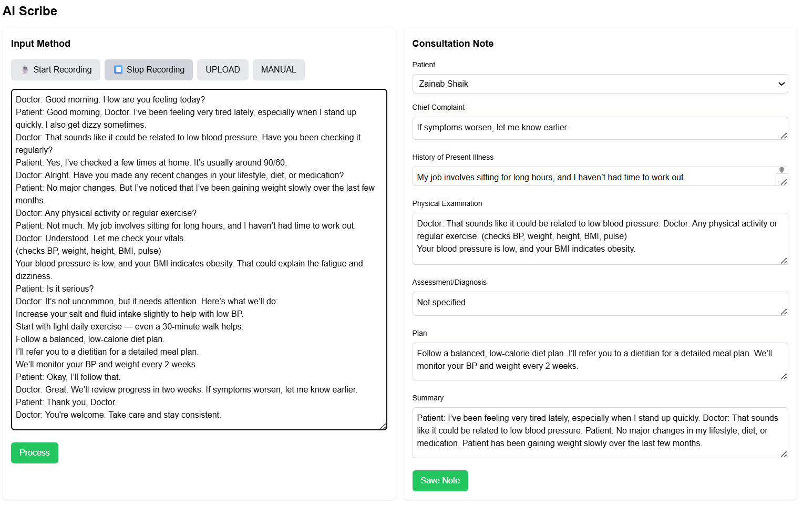
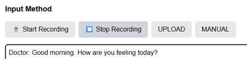
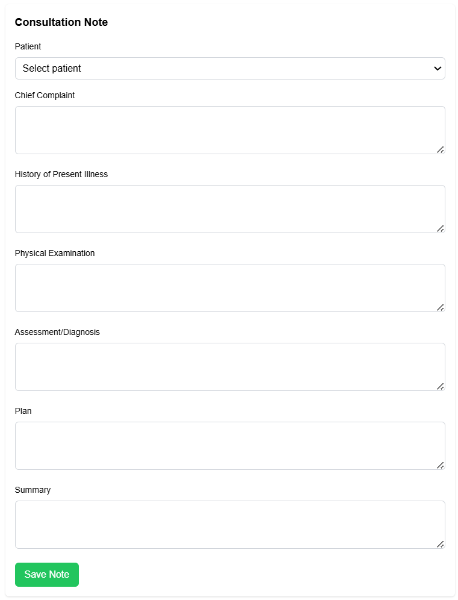
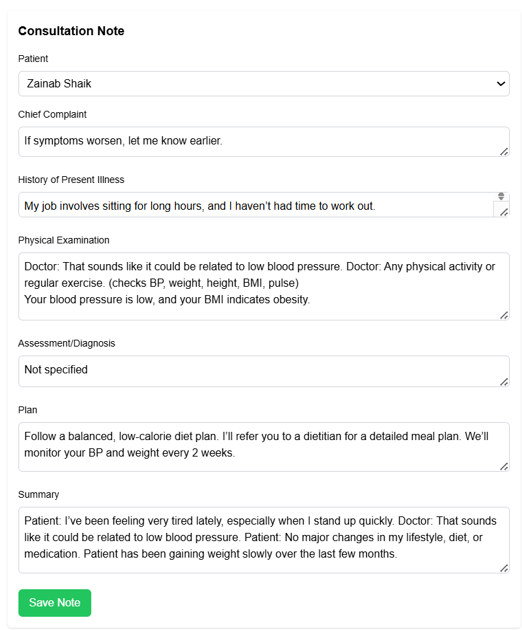

# Medical Scribe AI

## Overview

**Medical Scribe AI** is an intelligent tool designed to streamline medical documentation for doctors, particularly in resource-constrained settings like Tier-2 and Tier-3 hospitals in India. It listens to doctor-patient conversations, transcribes them in real-time, and structures the information into EMR-ready notes, saving doctors up to 50% of their documentation time. The app uses speech-to-text, NLP, and summarization to generate structured consultation notes with sections like **Chief Complaint, History, Examination, Diagnosis, Plan,** and **Summary**.

This project was developed as part of a hackathon on **May 18, 2025**, to address the problem of manual documentation, which consumes 40% of doctors' time and leads to errors, incomplete records, and reduced patient care efficiency.

---

## Features

- **Real-Time Transcription**: Transcribes doctor-patient conversations using Google Cloud Speech-to-Text.
- **Structured Notes**: Automatically extracts medical information into sections using a custom NLP pipeline.
- **Summarization**: Generates concise summaries of consultations using Hugging Face's BART model.
- **EMR Integration**: Saves notes in a format ready for integration with Electronic Medical Record systems.
- **User-Friendly Interface**: Built with React and Tailwind CSS for an intuitive experience.

---

## Problem Statement

Doctors in Tier-2 and Tier-3 hospitals spend up to **40% of their time** manually documenting patient consultations, reducing their capacity to see more patients, increasing the risk of errors, and contributing to burnout. The lack of an automated solution to capture and structure these conversations in real-time hampers healthcare efficiency and record quality.

---

## Tech Stack

- **Frontend**: React, Tailwind CSS  
- **Backend**: Node.js, Express, SQLite  
- **Speech-to-Text**: Google Cloud Speech-to-Text API  
- **NLP**: Custom keyword-based pipeline for structuring notes  
- **Summarization**: Hugging Face's BART model (`facebook/bart-large-cnn`)  
- **Real-Time Communication**: Socket.IO (for potential real-time transcription)  

---

## Project Structure

- **medical-scribe/**
  - **backend/**
    - `server.js` – Backend server with API endpoints
    - `database.db` – SQLite database for storing patients, notes, etc.
    - `.env` – Environment variables (e.g., API keys)
  - **frontend/**
    - **src/**
      - **components/**
        - `AIScribe.js` – AI Scribe page component
        - `...` – Other components (e.g., Dashboard, Patients)
      - `App.js` – Main React app component
      - `index.js` – Entry point for React
  - **screenshots/** – Folder for component screenshots
  - `README.md` – Project documentation

---

## Components and Screenshots

### 1. AI Scribe Page (`AIScribe.js`)
**Description:**  
The core feature of the app. Doctors can:
- Start/stop audio recording
- View real-time transcription
- View structured consultation note fields (Chief Complaint, History, etc.)
- Save, view, and delete notes

**Screenshot:**  
*Caption: The AI Scribe page showing a recorded consultation being transcribed and structured into a note.*

---

### 2. Recording Interface
**Description:**  
Captures audio using the MediaRecorder API. Includes:
- Start/Stop buttons
- Upload/manual input options
- Visual feedback for recording state

**Screenshot:**  
*Caption: The recording interface with Start/Stop buttons and options for upload or manual input.*

---

### 3. Structured Note Display
**Description:**  
Displays structured consultation notes. Sections include:
- Chief Complaint
- History
- Examination
- Diagnosis
- Plan
- Summary

Includes a **"Save Note"** button.

## Components and Screenshots

Below are the key components of the Medical Scribe AI app, along with descriptions and screenshots to illustrate their functionality.

### 1. AI Scribe Page (`AIScribe.js`)
**Description**:  
The AI Scribe page is the core feature of the app, allowing doctors to record patient consultations, transcribe them, and generate structured notes. It includes:
- A recording interface with Start/Stop buttons to capture audio.
- A textarea to display the transcribed text in real-time (or post-processing).
- A structured note section with fields for Chief Complaint, History, Examination, Diagnosis, Plan, and Summary.
- Options to save, view, and delete saved consultation notes.

**Screenshot**:  
  
*Caption*: The AI Scribe page showing a recorded consultation being transcribed and structured into a note.

### 2. Recording Interface
**Description**:  
This component, embedded in the AI Scribe page, uses the `MediaRecorder` API to capture audio from the doctor's microphone. It provides buttons to start and stop recording, and an upload/manual input option for flexibility. The interface is designed to be intuitive, with clear visual feedback (e.g., buttons disable/enable based on recording state).

**Screenshot**:  
  
*Caption*: The recording interface with Start/Stop buttons and options for upload or manual input.

### 3. Structured Note Display
**Description**:  
This component displays the structured consultation note generated by the NLP pipeline. It organizes the transcribed text into labeled sections (Chief Complaint, History, Examination, Diagnosis, Plan, Summary), making it easy for doctors to review and save the note to an EMR system. The fields are read-only to prevent accidental edits, with a "Save Note" button to store the note in the database.

**Screenshot**:  
  
*Caption*: The structured note display showing sections like Chief Complaint and Plan populated after processing.

### 4. Saved Consultation Notes
**Description**:  
This component lists all previously saved consultation notes, allowing doctors to view or delete them. Each note entry displays the patient’s name, timestamp, and a brief preview (e.g., Chief Complaint). It includes "View" and "Delete" buttons for managing notes, ensuring doctors have full control over their records.

**Screenshot**:  
  
*Caption*: The Saved Consultation Notes section listing past notes with View and Delete options.

---

### 4. Saved Consultation Notes
**Description:**  
Lists previously saved consultation notes with:
- Patient name
- Timestamp
- Preview (e.g., Chief Complaint)
- View/Delete buttons

**Screenshot:**  
*Caption: The Saved Consultation Notes section listing past notes with View and Delete options.*

---

## Usage

### Record a Consultation
1. Navigate to the **AI Scribe** page
2. Select a patient (e.g., *Rahul Mehta*)
3. Click **"Start Recording"** and speak:  
   _"Rahul reports chest pain for the last two weeks..."_
4. Click **"Stop Recording"**

### Process the Transcription
1. Click **"Process"** to structure the transcribed text
2. Review structured notes on the right panel

### Save the Note
1. Click **"Save Note"**
2. View or delete saved notes in the **"Saved Consultation Notes"** section

---

## Future Scope

- **Real-Time Transcription:** Add live transcription with `StreamingRecognize` API
- **Multilingual Support:** Support Indian languages like Hindi and Tamil
- **EMR Integration:** Sync with platforms like Practo and HealthPlix
- **Noise Cancellation:** Improve transcription accuracy in noisy settings

---

## Drawbacks and Challenges

- **Transcription Accuracy:** Errors may occur in noisy environments
- **Network Dependency:** Requires internet access for cloud APIs
- **Scalability:** SQLite is not ideal for large hospital deployments

---

## Contributors

- **[Your Name]** – Developer and Project Lead  
- **[Team Member Names]** – (Add others here)
